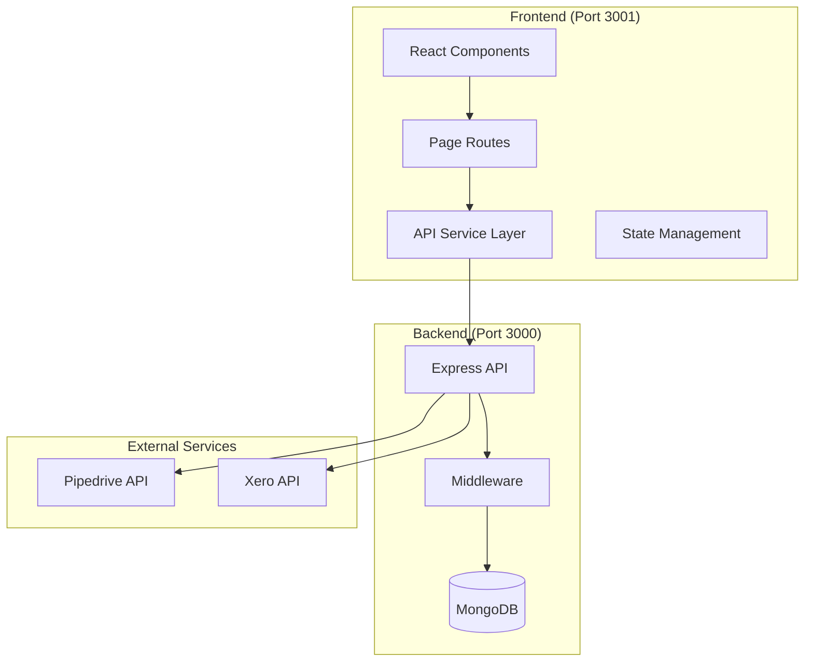
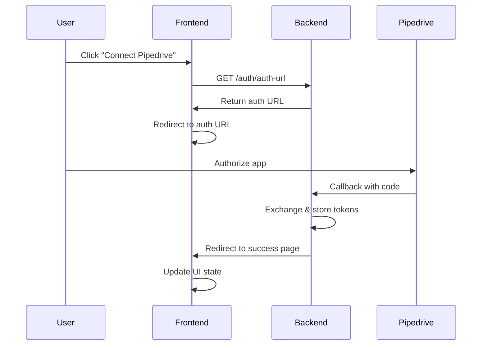
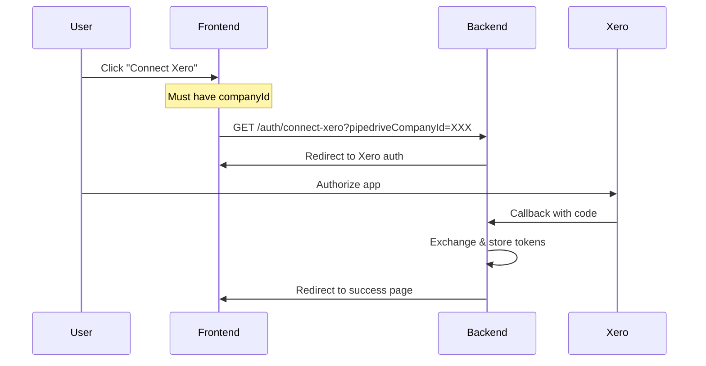

# 🎯 Frontend API Integration Guide for Pipedrive-Xero Application

<div align="center">


</div>

## 📋 Table of Contents

- [🎯 Overview](#-overview)
- [🏗️ Architecture](#️-architecture)
- [🔐 Authentication Flow](#-authentication-flow)
- [🌐 API Endpoints Reference](#-api-endpoints-reference)
- [🔧 Frontend Implementation Guide](#-frontend-implementation-guide)
- [⚠️ Error Handling](#️-error-handling)
- [🧪 Testing Strategies](#-testing-strategies)
- [✅ Review Checklist](#-review-checklist)

## 🎯 Overview

This guide provides comprehensive documentation for integrating a Next.js frontend with the Pipedrive-Xero Node.js backend API. The backend runs on port 3000 and the frontend on port 3001.

### **Key Integration Points**

| Feature | Backend Endpoint | Frontend Route | Purpose |
|---------|------------------|----------------|---------|
| 🔐 **Pipedrive Auth** | `/auth/` | `/auth/pipedrive` | OAuth initiation |
| 🔐 **Xero Auth** | `/auth/connect-xero` | `/auth/xero` | OAuth initiation |
| 💰 **Create Quote** | `/api/xero/create-quote` | `/create-quote` | Quote generation |
| 📋 **Create Project** | `/api/project/create-full` | `/create-project` | Project creation |
| 📊 **Deal Data View** | `/api/pipedrive-data` | `/pipedrive-data-view` | Deal information |

## 🏗️ Architecture



## 🔐 Authentication Flow

### **1. Pipedrive OAuth Flow**



### **2. Xero OAuth Flow**



## 🌐 API Endpoints Reference

### **Authentication Endpoints**

#### **Check Authentication Status**
```typescript
// GET or POST /auth/status
interface AuthStatusRequest {
  companyId: string;
}

interface AuthStatusResponse {
  authenticated: boolean;
  services: {
    pipedrive: boolean;
    xero: boolean;
  };
  companyId: string;
  requiresXeroConnection?: boolean;
}

// Example implementation
async function checkAuthStatus(companyId: string): Promise<AuthStatusResponse> {
  const response = await fetch(`${API_BASE_URL}/auth/status?companyId=${companyId}`);
  return response.json();
}
```

#### **Get Pipedrive Auth URL**
```typescript
// GET /auth/auth-url
interface AuthUrlResponse {
  authUrl: string;
}

async function getPipedriveAuthUrl(): Promise<string> {
  const response = await fetch(`${API_BASE_URL}/auth/auth-url`);
  const data: AuthUrlResponse = await response.json();
  return data.authUrl;
}
```

#### **Initiate Xero Connection**
```typescript
// Frontend should redirect to this URL
function connectXero(pipedriveCompanyId: string): void {
  window.location.href = `${API_BASE_URL}/auth/connect-xero?pipedriveCompanyId=${pipedriveCompanyId}`;
}
```

#### **Logout**
```typescript
// POST /auth/logout
interface LogoutRequest {
  companyId: string;
}

async function logout(companyId: string): Promise<void> {
  await fetch(`${API_BASE_URL}/auth/logout`, {
    method: 'POST',
    headers: { 'Content-Type': 'application/json' },
    body: JSON.stringify({ companyId })
  });
}
```

### **Pipedrive Data Endpoints**

#### **Get Pipedrive Deal Data**
```typescript
// GET /api/pipedrive-data
interface PipedriveDataRequest {
  companyId: string;
  dealId: string;
}

interface PipedriveDataResponse {
  success: boolean;
  deal: {
    id: number;
    title: string;
    value: number;
    currency: string;
    status: string;
    org_id: {
      name: string;
      value: number;
    };
    person_id?: {
      name: string;
      email: Array<{ value: string; primary: boolean }>;
    };
    // Custom fields based on environment config
    [key: string]: any;
  };
  person?: {
    id: number;
    name: string;
    email: Array<{ value: string; primary: boolean }>;
    phone: Array<{ value: string; primary: boolean }>;
  };
  organization?: {
    id: number;
    name: string;
    address: string;
  };
  products?: Array<{
    id: number;
    name: string;
    quantity: number;
    item_price: number;
    sum: number;
  }>;
}

async function getPipedriveData(companyId: string, dealId: string): Promise<PipedriveDataResponse> {
  const response = await fetch(`${API_BASE_URL}/api/pipedrive-data`, {
    method: 'GET',
    headers: { 'Content-Type': 'application/json' },
    body: JSON.stringify({ companyId, dealId })
  });
  
  if (!response.ok) {
    throw new Error(`Failed to fetch Pipedrive data: ${response.statusText}`);
  }
  
  return response.json();
}
```

### **Xero Integration Endpoints**

#### **Check Xero Status**
```typescript
// GET /api/xero/status
interface XeroStatusResponse {
  connected: boolean;
  tenantId?: string;
  tenantName?: string;
  tokenExpiresAt?: string;
}

async function checkXeroStatus(pipedriveCompanyId: string): Promise<XeroStatusResponse> {
  const response = await fetch(`${API_BASE_URL}/api/xero/status?pipedriveCompanyId=${pipedriveCompanyId}`);
  return response.json();
}
```

#### **Create Quote**
```typescript
// POST /api/xero/create-quote
interface CreateQuoteRequest {
  pipedriveCompanyId: string;
  pipedriveDealId: string;
}

interface CreateQuoteResponse {
  success: boolean;
  quoteNumber: string;
  quoteId: string;
  contactName: string;
  totalAmount: number;
  lineItemsCount: number;
  pipedriveDealUpdated: boolean;
}

async function createXeroQuote(request: CreateQuoteRequest): Promise<CreateQuoteResponse> {
  const response = await fetch(`${API_BASE_URL}/api/xero/create-quote`, {
    method: 'POST',
    headers: { 'Content-Type': 'application/json' },
    body: JSON.stringify(request)
  });
  
  if (!response.ok) {
    const error = await response.json();
    throw new Error(error.error || 'Failed to create quote');
  }
  
  return response.json();
}
```

### **Project Management Endpoints**

#### **Create Full Project**
```typescript
// POST /api/project/create-full
interface CreateProjectRequest {
  pipedriveDealId: string;
  pipedriveCompanyId: string;
  existingProjectNumberToLink?: string; // Optional: link to existing project
}

interface CreateProjectResponse {
  success: boolean;
  projectNumber: string; // e.g., "NY25001"
  deal: any; // Full deal object
  person?: any; // Contact details
  organization?: any; // Company details
  products?: any[]; // Deal products
  xero?: {
    projectCreated: boolean;
    projectId?: string;
    projectName?: string;
    contactId?: string;
    tasksCreated?: string[];
    quoteAccepted?: boolean;
    error?: string;
  };
  metadata: {
    dealId: string;
    companyId: string;
    isNewProject: boolean;
  };
}

async function createProject(request: CreateProjectRequest): Promise<CreateProjectResponse> {
  const response = await fetch(`${API_BASE_URL}/api/project/create-full`, {
    method: 'POST',
    headers: { 'Content-Type': 'application/json' },
    body: JSON.stringify(request)
  });
  
  if (!response.ok) {
    const error = await response.json();
    throw new Error(error.error || 'Failed to create project');
  }
  
  return response.json();
}
```

## 🔧 Frontend Implementation Guide

### **1. Environment Configuration**

```typescript
// .env.local
NEXT_PUBLIC_API_BASE_URL=http://localhost:3000
NEXT_PUBLIC_FRONTEND_BASE_URL=http://localhost:3001
```

### **2. API Service Layer**

```typescript
// services/api.ts
class ApiService {
  private baseUrl: string;
  
  constructor() {
    this.baseUrl = process.env.NEXT_PUBLIC_API_BASE_URL || 'http://localhost:3000';
  }
  
  private async handleResponse<T>(response: Response): Promise<T> {
    if (!response.ok) {
      const error = await response.json().catch(() => ({ error: 'Unknown error' }));
      throw new Error(error.error || `HTTP ${response.status}: ${response.statusText}`);
    }
    return response.json();
  }
  
  async checkAuthStatus(companyId: string): Promise<AuthStatusResponse> {
    const response = await fetch(`${this.baseUrl}/auth/status?companyId=${companyId}`);
    return this.handleResponse<AuthStatusResponse>(response);
  }
  
  async createQuote(companyId: string, dealId: string): Promise<CreateQuoteResponse> {
    const response = await fetch(`${this.baseUrl}/api/xero/create-quote`, {
      method: 'POST',
      headers: { 'Content-Type': 'application/json' },
      body: JSON.stringify({
        pipedriveCompanyId: companyId,
        pipedriveDealId: dealId
      })
    });
    return this.handleResponse<CreateQuoteResponse>(response);
  }
  
  // Add other methods...
}

export const apiService = new ApiService();
```

### **3. Authentication Pages**

#### **Pipedrive Success Page (`/auth/pipedrive/success`)**
```typescript
// pages/auth/pipedrive/success.tsx
import { useEffect, useState } from 'react';
import { useRouter } from 'next/router';

export default function PipedriveAuthSuccess() {
  const router = useRouter();
  const [status, setStatus] = useState<'loading' | 'success' | 'error'>('loading');
  
  useEffect(() => {
    const { code, state, error } = router.query;
    
    if (error) {
      setStatus('error');
      return;
    }
    
    if (code && state) {
      // Backend handles the token exchange
      setStatus('success');
      
      // Redirect to main app or dashboard
      setTimeout(() => {
        router.push('/dashboard');
      }, 2000);
    }
  }, [router.query]);
  
  return (
    <div className="auth-status-container">
      {status === 'loading' && <p>Processing authentication...</p>}
      {status === 'success' && <p>Successfully connected to Pipedrive!</p>}
      {status === 'error' && <p>Authentication failed. Please try again.</p>}
    </div>
  );
}
```

#### **Xero Success Page (`/auth/xero/success`)**
```typescript
// pages/auth/xero/success.tsx
export default function XeroAuthSuccess() {
  // Similar implementation to Pipedrive success page
  // Can include additional Xero-specific success messaging
}
```

### **4. Deal Action Pages**

#### **Pipedrive Data View (`/pipedrive-data-view`)**
```typescript
// pages/pipedrive-data-view.tsx
import { useEffect, useState } from 'react';
import { useRouter } from 'next/router';
import { apiService } from '../services/api';

export default function PipedriveDataView() {
  const router = useRouter();
  const { companyId, dealId } = router.query;
  const [dealData, setDealData] = useState<PipedriveDataResponse | null>(null);
  const [loading, setLoading] = useState(true);
  const [error, setError] = useState<string | null>(null);
  
  useEffect(() => {
    if (companyId && dealId) {
      loadDealData(companyId as string, dealId as string);
    }
  }, [companyId, dealId]);
  
  const loadDealData = async (companyId: string, dealId: string) => {
    try {
      setLoading(true);
      const data = await apiService.getPipedriveData(companyId, dealId);
      setDealData(data);
    } catch (err) {
      setError(err.message);
    } finally {
      setLoading(false);
    }
  };
  
  const handleCreateQuote = async () => {
    if (!companyId || !dealId) return;
    
    try {
      const result = await apiService.createQuote(
        companyId as string,
        dealId as string
      );
      
      // Show success message
      alert(`Quote ${result.quoteNumber} created successfully!`);
      
      // Reload deal data to show updated quote number
      await loadDealData(companyId as string, dealId as string);
    } catch (err) {
      alert(`Failed to create quote: ${err.message}`);
    }
  };
  
  if (loading) return <div>Loading deal data...</div>;
  if (error) return <div>Error: {error}</div>;
  if (!dealData) return <div>No deal data found</div>;
  
  return (
    <div className="deal-view-container">
      <h1>{dealData.deal.title}</h1>
      
      <section className="deal-details">
        <h2>Deal Information</h2>
        <p>Value: {dealData.deal.currency} {dealData.deal.value}</p>
        <p>Status: {dealData.deal.status}</p>
        <p>Organization: {dealData.deal.org_id?.name}</p>
      </section>
      
      {dealData.products && dealData.products.length > 0 && (
        <section className="products">
          <h2>Products</h2>
          <table>
            <thead>
              <tr>
                <th>Product</th>
                <th>Quantity</th>
                <th>Price</th>
                <th>Total</th>
              </tr>
            </thead>
            <tbody>
              {dealData.products.map(product => (
                <tr key={product.id}>
                  <td>{product.name}</td>
                  <td>{product.quantity}</td>
                  <td>{product.item_price}</td>
                  <td>{product.sum}</td>
                </tr>
              ))}
            </tbody>
          </table>
        </section>
      )}
      
      <section className="actions">
        <button onClick={handleCreateQuote} className="btn-primary">
          Create Xero Quote
        </button>
        <button onClick={() => router.push(`/create-project?companyId=${companyId}&dealId=${dealId}`)} className="btn-secondary">
          Create Project
        </button>
      </section>
    </div>
  );
}
```

### **5. State Management**

```typescript
// store/authStore.ts
import { create } from 'zustand';

interface AuthStore {
  companyId: string | null;
  isAuthenticated: {
    pipedrive: boolean;
    xero: boolean;
  };
  setCompanyId: (id: string) => void;
  setAuthStatus: (service: 'pipedrive' | 'xero', status: boolean) => void;
  checkAuthStatus: (companyId: string) => Promise<void>;
}

export const useAuthStore = create<AuthStore>((set) => ({
  companyId: null,
  isAuthenticated: {
    pipedrive: false,
    xero: false
  },
  
  setCompanyId: (id) => set({ companyId: id }),
  
  setAuthStatus: (service, status) => 
    set((state) => ({
      isAuthenticated: {
        ...state.isAuthenticated,
        [service]: status
      }
    })),
    
  checkAuthStatus: async (companyId) => {
    const response = await apiService.checkAuthStatus(companyId);
    set({
      companyId,
      isAuthenticated: {
        pipedrive: response.services.pipedrive,
        xero: response.services.xero
      }
    });
  }
}));
```

### **6. Protected Routes**

```typescript
// components/ProtectedRoute.tsx
import { useEffect } from 'react';
import { useRouter } from 'next/router';
import { useAuthStore } from '../store/authStore';

interface ProtectedRouteProps {
  children: React.ReactNode;
  requireXero?: boolean;
}

export function ProtectedRoute({ children, requireXero = false }: ProtectedRouteProps) {
  const router = useRouter();
  const { companyId, isAuthenticated } = useAuthStore();
  
  useEffect(() => {
    if (!companyId || !isAuthenticated.pipedrive) {
      router.push('/auth/pipedrive');
      return;
    }
    
    if (requireXero && !isAuthenticated.xero) {
      router.push(`/auth/xero?companyId=${companyId}`);
      return;
    }
  }, [companyId, isAuthenticated, requireXero]);
  
  if (!companyId || !isAuthenticated.pipedrive) {
    return <div>Authenticating...</div>;
  }
  
  if (requireXero && !isAuthenticated.xero) {
    return <div>Connecting to Xero...</div>;
  }
  
  return <>{children}</>;
}
```

## ⚠️ Error Handling

### **API Error Response Format**

```typescript
interface ApiError {
  error: string;
  requestId?: string;
  statusCode?: number;
  missingField?: string;
  details?: any;
}
```

### **Frontend Error Handler**

```typescript
// utils/errorHandler.ts
export class ApiError extends Error {
  statusCode: number;
  requestId?: string;
  details?: any;
  
  constructor(message: string, statusCode: number, requestId?: string, details?: any) {
    super(message);
    this.statusCode = statusCode;
    this.requestId = requestId;
    this.details = details;
  }
}

export async function handleApiError(response: Response): Promise<never> {
  const contentType = response.headers.get('content-type');
  
  if (contentType && contentType.includes('application/json')) {
    const error = await response.json();
    throw new ApiError(
      error.error || 'Unknown error',
      response.status,
      error.requestId,
      error.details
    );
  } else {
    throw new ApiError(
      `HTTP ${response.status}: ${response.statusText}`,
      response.status
    );
  }
}
```

### **Error Boundary Component**

```typescript
// components/ErrorBoundary.tsx
import React from 'react';

interface ErrorBoundaryState {
  hasError: boolean;
  error?: Error;
}

export class ErrorBoundary extends React.Component<
  { children: React.ReactNode },
  ErrorBoundaryState
> {
  constructor(props: { children: React.ReactNode }) {
    super(props);
    this.state = { hasError: false };
  }
  
  static getDerivedStateFromError(error: Error): ErrorBoundaryState {
    return { hasError: true, error };
  }
  
  componentDidCatch(error: Error, errorInfo: React.ErrorInfo) {
    console.error('Error caught by boundary:', error, errorInfo);
    
    // Send to error tracking service
    if (typeof window !== 'undefined' && window.gtag) {
      window.gtag('event', 'exception', {
        description: error.toString(),
        fatal: true
      });
    }
  }
  
  render() {
    if (this.state.hasError) {
      return (
        <div className="error-fallback">
          <h1>Something went wrong</h1>
          <p>{this.state.error?.message}</p>
          <button onClick={() => window.location.reload()}>
            Reload Page
          </button>
        </div>
      );
    }
    
    return this.props.children;
  }
}
```

## 🧪 Testing Strategies

### **1. API Mocking**

```typescript
// __tests__/mocks/api.ts
import { rest } from 'msw';
import { setupServer } from 'msw/node';

export const server = setupServer(
  rest.get('http://localhost:3000/auth/status', (req, res, ctx) => {
    const companyId = req.url.searchParams.get('companyId');
    
    return res(
      ctx.json({
        authenticated: true,
        services: {
          pipedrive: true,
          xero: companyId === 'test-with-xero'
        },
        companyId
      })
    );
  }),
  
  rest.post('http://localhost:3000/api/xero/create-quote', (req, res, ctx) => {
    return res(
      ctx.json({
        success: true,
        quoteNumber: 'QU-0001',
        quoteId: 'test-quote-id',
        contactName: 'Test Company',
        totalAmount: 1000,
        lineItemsCount: 2,
        pipedriveDealUpdated: true
      })
    );
  })
);
```

### **2. Component Testing**

```typescript
// __tests__/components/PipedriveDataView.test.tsx
import { render, screen, waitFor } from '@testing-library/react';
import userEvent from '@testing-library/user-event';
import PipedriveDataView from '../../pages/pipedrive-data-view';
import { server } from '../mocks/api';

beforeAll(() => server.listen());
afterEach(() => server.resetHandlers());
afterAll(() => server.close());

describe('PipedriveDataView', () => {
  it('loads and displays deal data', async () => {
    render(<PipedriveDataView />);
    
    await waitFor(() => {
      expect(screen.getByText('Test Deal')).toBeInTheDocument();
    });
    
    expect(screen.getByText('Value: USD 1000')).toBeInTheDocument();
  });
  
  it('handles quote creation', async () => {
    const user = userEvent.setup();
    render(<PipedriveDataView />);
    
    await waitFor(() => {
      expect(screen.getByText('Create Xero Quote')).toBeInTheDocument();
    });
    
    await user.click(screen.getByText('Create Xero Quote'));
    
    await waitFor(() => {
      expect(screen.getByText(/Quote QU-0001 created successfully/)).toBeInTheDocument();
    });
  });
});
```

### **3. Integration Testing**

```typescript
// __tests__/integration/auth-flow.test.tsx
import { render, screen } from '@testing-library/react';
import { useRouter } from 'next/router';
import AuthFlow from '../../pages/auth/pipedrive';

jest.mock('next/router', () => ({
  useRouter: jest.fn()
}));

describe('Authentication Flow', () => {
  it('redirects to pipedrive auth URL', async () => {
    const push = jest.fn();
    (useRouter as jest.Mock).mockReturnValue({
      push,
      query: {}
    });
    
    render(<AuthFlow />);
    
    expect(push).toHaveBeenCalledWith(
      expect.stringContaining('oauth.pipedrive.com/oauth/authorize')
    );
  });
});
```

## ✅ Review Checklist

### **🔐 Authentication & Security**

- [ ] **CSRF Protection**: Verify state parameter handling in OAuth callbacks
- [ ] **Token Storage**: Ensure no sensitive tokens are stored in localStorage/cookies
- [ ] **API Key Protection**: All API keys should be in environment variables
- [ ] **Error Messages**: Don't expose sensitive information in error messages
- [ ] **HTTPS**: Ensure all API calls use HTTPS in production

### **🌐 API Integration**

- [ ] **Error Handling**: All API calls have proper error handling
- [ ] **Loading States**: UI shows loading indicators during API calls
- [ ] **Retry Logic**: Implement retry for failed API calls (with exponential backoff)
- [ ] **Request Cancellation**: Cancel pending requests on component unmount
- [ ] **Response Validation**: Validate API responses match expected schema

### **🎨 User Experience**

- [ ] **Authentication Flow**: Clear UI for connecting Pipedrive and Xero
- [ ] **Status Indicators**: Show connection status for both services
- [ ] **Error Messages**: User-friendly error messages with actionable steps
- [ ] **Success Feedback**: Clear confirmation when actions complete
- [ ] **Navigation**: Intuitive flow between authentication and features

### **📊 State Management**

- [ ] **Persistent State**: Company ID and auth status persist across sessions
- [ ] **State Sync**: Frontend state syncs with backend auth status
- [ ] **Optimistic Updates**: UI updates optimistically where appropriate
- [ ] **Cache Management**: Proper cache invalidation after mutations

### **🧪 Testing Coverage**

- [ ] **Unit Tests**: API service layer functions tested
- [ ] **Component Tests**: All major components have tests
- [ ] **Integration Tests**: Full user flows tested end-to-end
- [ ] **Error Scenarios**: Tests cover error cases and edge conditions
- [ ] **Mocking**: API calls properly mocked in tests

### **⚡ Performance**

- [ ] **Code Splitting**: Routes are lazy loaded
- [ ] **API Call Optimization**: Batch API calls where possible
- [ ] **Caching**: Implement appropriate caching strategies
- [ ] **Bundle Size**: Monitor and optimize bundle size

### **🔧 Configuration**

- [ ] **Environment Variables**: All configs in .env files
- [ ] **Build Configuration**: Separate configs for dev/staging/prod
- [ ] **CORS Setup**: Verify CORS allows frontend domain
- [ ] **API Timeouts**: Reasonable timeout values for API calls

### **📝 Documentation**

- [ ] **API Types**: TypeScript interfaces for all API responses
- [ ] **Component Props**: PropTypes or TypeScript for components
- [ ] **Code Comments**: Complex logic is well documented
- [ ] **README**: Setup and deployment instructions

### **🚀 Deployment**

- [ ] **Environment Variables**: All required vars configured
- [ ] **Build Process**: Production build runs without errors
- [ ] **API URLs**: Correct API URLs for production
- [ ] **Error Tracking**: Error tracking service integrated
- [ ] **Monitoring**: Application monitoring in place

## 🎯 Key Implementation Tips

1. **Always use the backend's `/auth/status` endpoint** to verify authentication state rather than relying on frontend state alone.

2. **Handle token expiration gracefully** - the backend automatically refreshes tokens, but the frontend should handle 401 responses by re-checking auth status.

3. **Use proper loading and error states** for all API operations to provide good user feedback.

4. **Implement proper URL handling** for OAuth callbacks - the backend redirects to specific frontend routes after authentication.

5. **Respect the backend's CORS configuration** - ensure all API calls originate from allowed domains.

6. **Follow the authentication flow strictly** - Pipedrive must be authenticated before Xero can be connected.

7. **Use TypeScript** for better type safety and developer experience when working with API responses.

8. **Implement proper error boundaries** to catch and handle unexpected errors gracefully.

---

This guide provides a comprehensive foundation for integrating your Next.js frontend with the Pipedrive-Xero backend API. Follow the patterns and best practices outlined here to ensure a robust and maintainable integration. 